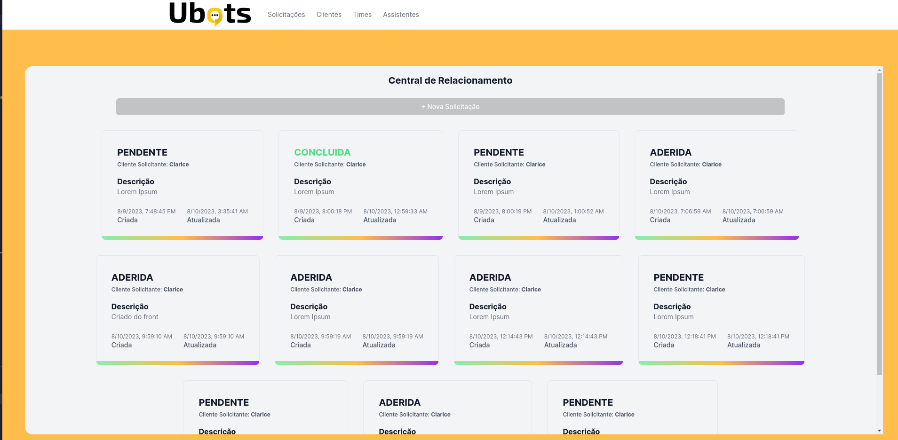
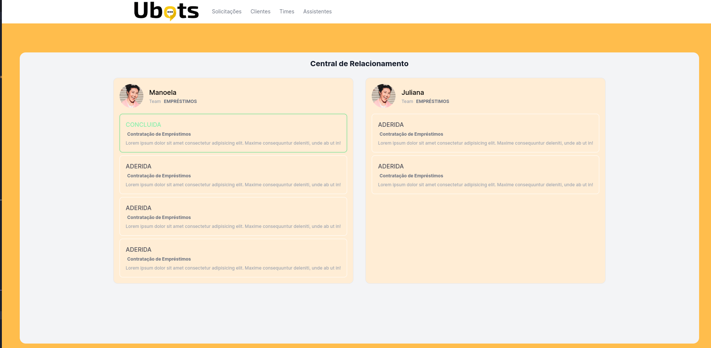
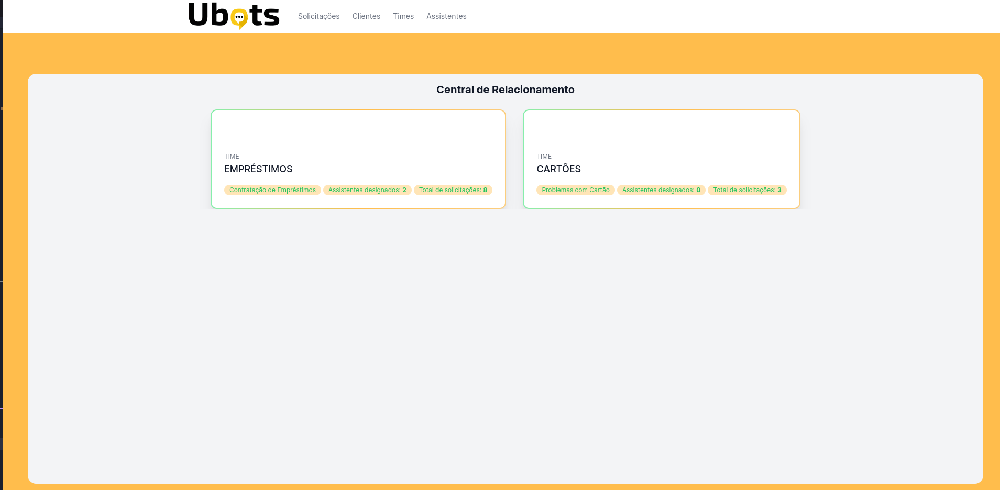
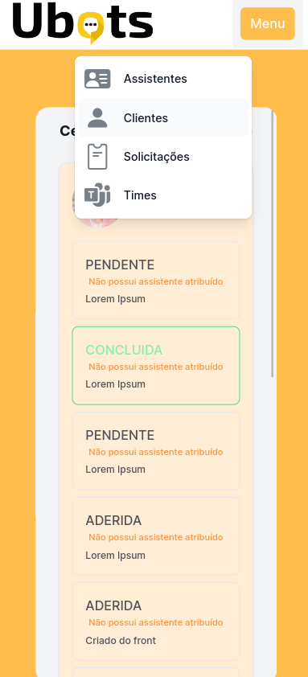
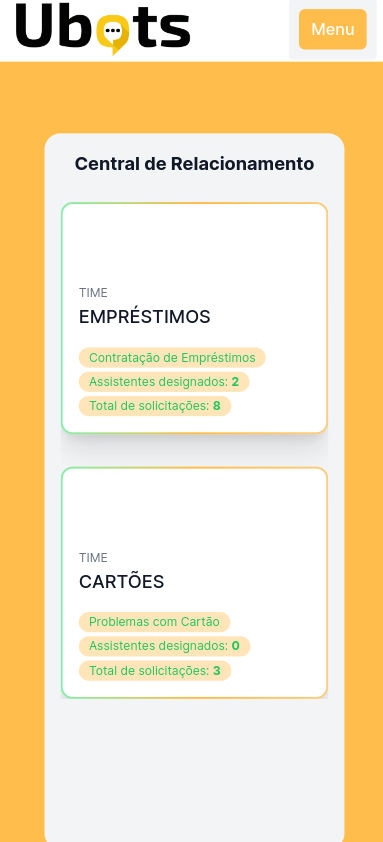
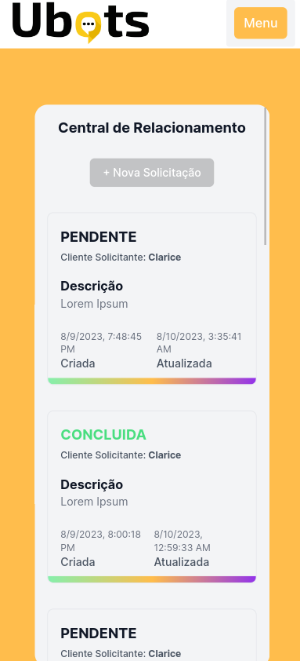

# **Ubots: Invext Fron-End - Dev (Lucas Vieira)**
Desafio Técnico Ubots: Construção de uma <b>API</b> para automação de uma Central de Relacionamento

</br>

### Link do Deploy na Vercel: https://leadster-test-theta.vercel.app/

</br>

# Layout da Aplicação

## Desktop


#

#


</br>

## Mobile


#

#



## Organização do Código

- O código utilizou o NextJS 13 em sua última atualização bem como os seguintes recursos: ***App Router*** e ***Router Handlers*** de uma maneira bem simples (fecth) para lidar com as requisição a API
- O foco maior se ateve ao back-end e as regras de negócio

</br>

## Instruções de Execução do Projeto

📌 **ATENÇÃO**

Antes de executar o projeto, saiba que a pretensão fora confeccionar  o foront-end para contemplar principalmente uma visualização um pouco mais concreta e menos conceitual da *API Invext* que é o núcleo do sistema e significar o requisito full-stack da oportunidade.

Por tanto é **RECOMENDADO** que **o servidor da API esteja em execução** e com o funcionamento integrado para uma melhor experiência

### **AMBIENTE DE DESENVOLVIMENTO**

Primeiro, clone este reposiótio:

```bash
$ git clone git@github.com:lkasvr/leadster-test.git
```
Depois, execute os comandos abaixo na raíz do projeto:

```bash
npm install
```

```bash
npm run dev
```

</br>

### **AMBIENTE DE PRODUÇÃO**

Após os comandos acima, para simular a execução em produção execute os seguintes comandos:

```bash
npm run build
# e
npm run start
```

Abra [http://localhost:3000](http://localhost:3000) para ver o resultado.


